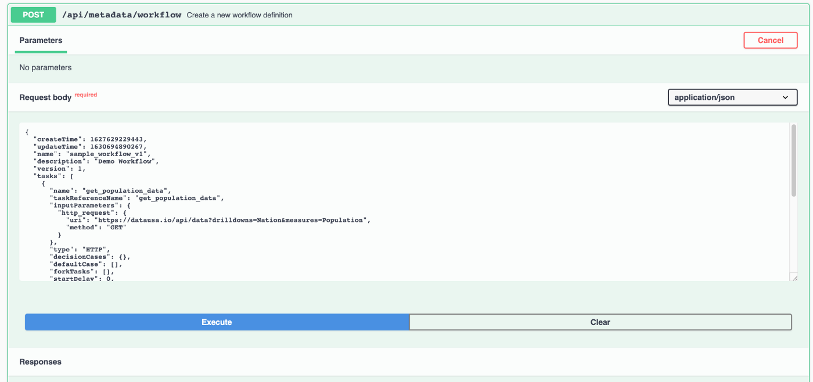
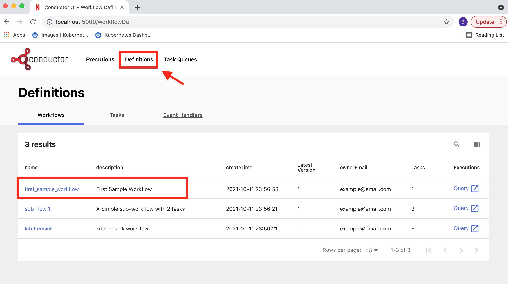
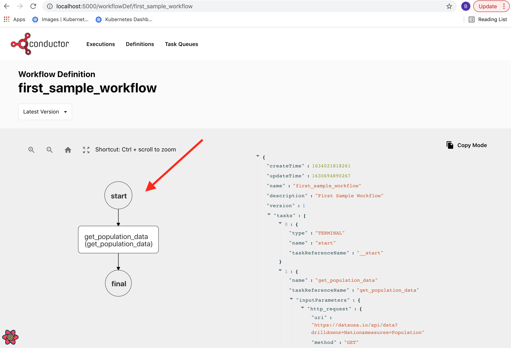
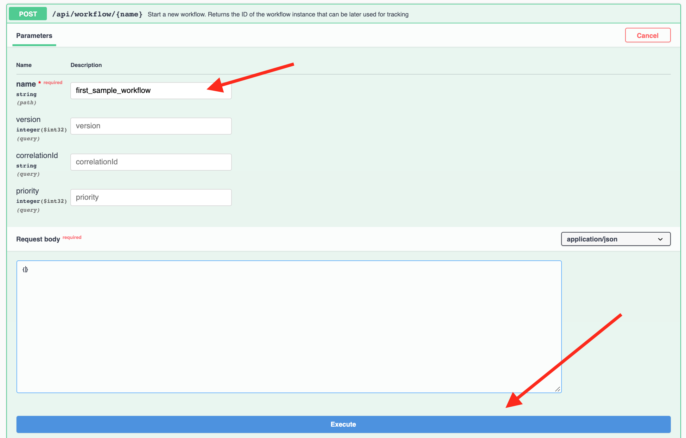
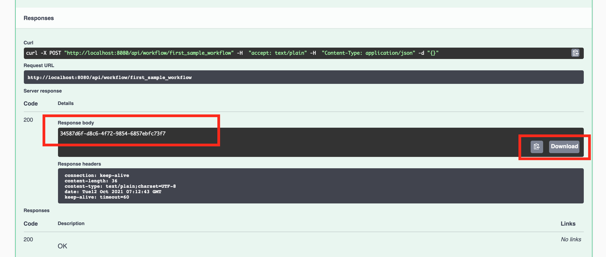
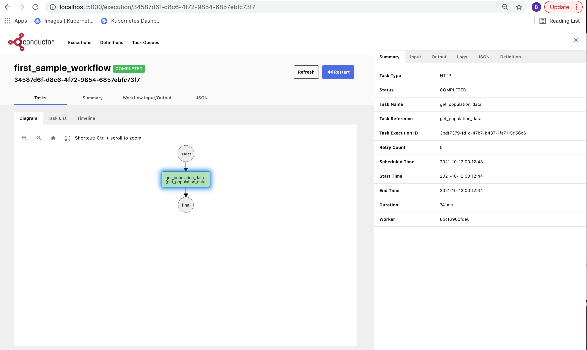

# A First Workflow

In this article we will explore how we can run a really simple workflow that runs without deploying any new microservice. 

Conductor can orchestrate HTTP services out of the box without implementing any code.  We will use that to create and run the first workflow.

See [System Task](../../reference/systemtasks/index.md) for the list of such built-in tasks.
Using system tasks is a great way to run a lot of our code in production.

To bring up a local instance of Conductor follow one of the recommended steps:

1. [Running Locally - From Code](../../getting-started/running/source.md)
2. [Running Locally - Docker Compose](../../getting-started/running/docker.md)

---

## Configuring our First Workflow

This is a sample workflow that we can leverage for our test.

```json
{
  "name": "first_sample_workflow",
  "description": "First Sample Workflow",
  "version": 1,
  "tasks": [
    {
      "name": "get_population_data",
      "taskReferenceName": "get_population_data",
      "inputParameters": {
        "http_request": {
          "uri": "https://datausa.io/api/data?drilldowns=Nation&measures=Population",
          "method": "GET"
        }
      },
      "type": "HTTP"
    }
  ],
  "inputParameters": [],
  "outputParameters": {
    "data": "${get_population_data.output.response.body.data}",
    "source": "${get_population_data.output.response.body.source}"
  },
  "schemaVersion": 2,
  "restartable": true,
  "workflowStatusListenerEnabled": false,
  "ownerEmail": "example@email.com",
  "timeoutPolicy": "ALERT_ONLY",
  "timeoutSeconds": 0
}
```

This is an example workflow that queries a publicly available JSON API to retrieve some data. This workflow doesn’t
require any worker implementation as the tasks in this workflow are managed by the system itself. This is an awesome
feature of Conductor. For a lot of typical work, we won’t have to write any code at all.

Let's talk about this workflow a little more so that we can gain some context.

```json
"name" : "first_sample_workflow"
```

This line here is how we name our workflow. In this case our workflow name is `first_sample_workflow`

This workflow contains just one worker. The workers are defined under the key `tasks`. Here is the worker definition
with the most important values:

```json
{
  "name": "get_population_data",
  "taskReferenceName": "get_population_data",
  "inputParameters": {
    "http_request": {
      "uri": "https://datausa.io/api/data?drilldowns=Nation&measures=Population",
      "method": "GET"
    }
  },
  "type": "HTTP"
}
```

Here is a list of fields and what it does:

1. `"name"` : Name of our worker
2. `"taskReferenceName"` : This is a reference to this worker in this specific workflow implementation. We can have multiple
   workers of the same name in our workflow, but we will need a unique task reference name for each of them. Task
   reference name should be unique across our entire workflow.
3. `"inputParameters"` : These are the inputs into our worker. We can hard code inputs as we have done here. We can
   also provide dynamic inputs such as from the workflow input or based on the output of another worker. We can find
   examples of this in our documentation.
4. `"type"` : This is what defines what the type of worker is. In our example - this is `HTTP`. There are more task
   types which we can find in the Swift Conductor documentation.
5. `"http_request"` : This is an input that is required for tasks of type `HTTP`. In our example we have provided a well
   known internet JSON API url and the type of HTTP method to invoke - `GET`

We haven't talked about the other fields that we can use in our definitions as these are either just
metadata or more advanced concepts which we can learn more in the detailed documentation.

Ok, now that we have walked through our workflow details, let's run this and see how it works.

To configure the workflow, head over to the swagger API of conductor server and access the metadata workflow create API:

[http://{{ server_host }}/swagger-ui/index.html?configUrl=/api-docs/swagger-config#/metadata-resource/create](http://{{ server_host }}/swagger-ui/index.html?configUrl=/api-docs/swagger-config#/metadata-resource/create)

If the link doesn’t open the right Swagger section, we can navigate to Metadata-Resource
→ `POST {{ api_prefix }}/metadata/workflowdef`



Paste the workflow payload into the Swagger API and hit Execute.

Now if we head over to the UI, we can see this workflow definition created:



If we click through we can see a visual representation of the workflow:



## Running our First Workflow

Let’s run this workflow. To do that we can use the swagger API under the workflow-resources

[http://{{ server_host }}/swagger-ui/index.html?configUrl=/api-docs/swagger-config#/workflow-resource/startWorkflow_1](http://{{ server_host }}/swagger-ui/index.html?configUrl=/api-docs/swagger-config#/workflow-resource/startWorkflow_1)



Hit **Execute**!

Conductor will return a workflow id. We will need to use this id to load this up on the UI. If our UI installation has
search enabled we wouldn't need to copy this. If we don't have search enabled (using Elasticsearch) copy it from the
Swagger UI.



Ok, we should see this running and get completed soon. Let’s go to the UI to see what happened.

To load the workflow directly, use this URL format:

```
http://localhost:5000/execution/<WORKFLOW_ID>
```

Replace `<WORKFLOW_ID>` with our workflow id from the previous step. We should see a screen like below. Click on the
different tabs to see all inputs and outputs and task list etc. Explore away!



## Summary

In this article — we learned how to run a sample workflow in our Conductor installation. Concepts we touched on:

1. Workflow creation
2. System tasks such as HTTP
3. Running a workflow via API
