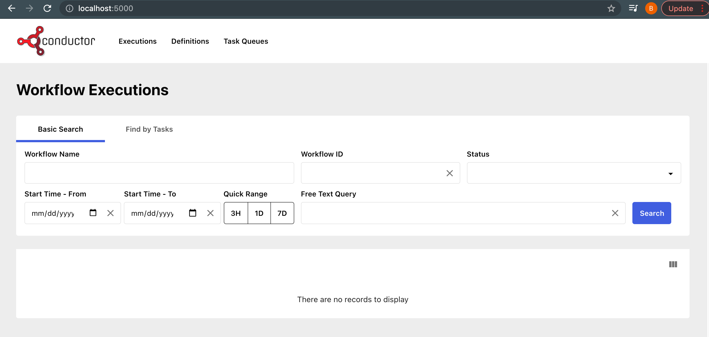

# Building Conductor From Source

## Prerequisites

1. JDK 17 or greater
1. [Podman](https://podman.io) to in order to run Redis and ElasticSearch.
1. Node for building and running UI. Instructions at [https://nodejs.org](https://nodejs.org).
1. Npm for building and running UI. Instructions at [https://www.npmjs.com/](https://www.npmjs.com/).
1. [Redis](redis.md) instance
1. [Elastic Search 6](elastic_search_6.md) instance
1. [Docker](https://www.docker.com) if you want to run server tests (Optional). 

## Build the server

Clone the Swift Conductor code from the [conductor](https://github.com/swift-conductor/conductor) repo.

```sh
git clone https://github.com/swift-conductor/conductor.git
```

### Run

```sh
./gradlew server
```

Navigate to the Swagger API docs:

[http://localhost:8080/swagger-ui/index.html](http://localhost:8080/swagger-ui/index.html)


> **NOTE for Mac with an Apple Silicon users**: If you are using a new Mac with an Apple Silicon Chip, you must make a small change to ```conductor/grpc/build.gradle``` - adding "osx-x86_64" to two lines:

```
protobuf {
    protoc {
        artifact = "com.google.protobuf:protoc:${revProtoBuf}:osx-x86_64"
    }
    plugins {
        grpc {
            artifact = "io.grpc:protoc-gen-grpc-java:${revGrpc}:osx-x86_64"
        }
    }
...
} 
```

You also need to install Rosetta:  

```sh
softwareupdate --install-rosetta
```

<!-- ### Download and run the server

As an alternative to building from source, you can download and run the pre-compiled JAR.

```sh
export CONDUCTOR_VER=3.16.0
export REPO_URL=https://repo1.maven.org/maven2/com/swiftconductor/conductor/conductor-server
curl $REPO_URL/$CONDUCTOR_VER/conductor-server-$CONDUCTOR_VER-boot.jar \
--output conductor-server-$CONDUCTOR_VER-boot.jar; java -jar conductor-server-$CONDUCTOR_VER-boot.jar 
```

Navigate to the Swagger API docs:

[http://localhost:8080/swagger-ui/index.html?configUrl=/api-docs/swagger-config](http://localhost:8080/swagger-ui/index.html?configUrl=/api-docs/swagger-config) -->

## Build and run the UI

Clone Swift Conductor UI code from the [conductor-ui](https://github.com/swift-conductor/conductor-ui) repo.

```sh
git clone https://github.com/swift-conductor/conductor-ui
```

### Install packages

You need Node 14 and `npm` installed. After that run `npm install` to install all packages:

```sh
npm install
```

### Run

```sh
npm run start
```

Open [http://localhost:5000](http://localhost:5000) in your browser. 



If you require compiled assets to host on a production web server, the project can be built with the command `npm run build`.
