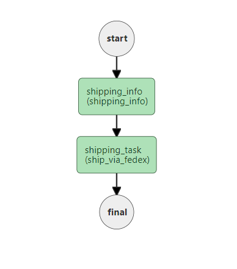
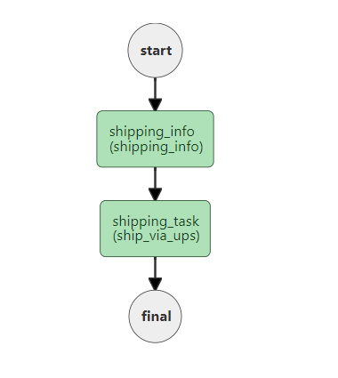

# Dynamic
```json
"type" : "DYNAMIC"
```
The `DYNAMIC` task allows one to execute a task whose name is resolved dynamically at run-time.
The task name to execute is specified as `taskToExecute` in `inputParameters`.

## Use Cases 

Consider a scenario, when we have to make decision of executing a task dynamically i.e. while the workflow is still
running. In such cases, Dynamic Task would be useful.

## Configuration
To use the `DYNAMIC` task, you need to provide `dynamicTaskNameParam` at the top level of the task configuration, **as well as** an attribute in `inputParameters` matching the value you selected for `dynamicTaskNameParam`.

| name                 | description                                                                                                   |
| -------------------- | ------------------------------------------------------------------------------------------------------------- |
| dynamicTaskNameParam | Name of the parameter from `inputParameters` whose value is used to schedule the task. e.g. `"taskToExecute"` |

### inputParameters
| name                                      | description              |
| ----------------------------------------- | ------------------------ |
| *dynamicTaskNameParam e.g. `taskToExecute` | Name of task to execute. |


## Example

Suppose in a workflow, we have to take decision to ship the courier with the shipping
service providers on the basis of Post Code.

Consider the following 3 task definitions.

The following task `shipping_info` generates an output on the basis of which decision would be
taken to run the next task.

```json
{
  "name": "shipping_info",
  "retryCount": 3,
  "timeoutSeconds": 600,
  "pollTimeoutSeconds": 1200,
  "timeoutPolicy": "TIME_OUT_WF",
  "retryLogic": "FIXED",
  "retryDelaySeconds": 300,
  "responseTimeoutSeconds": 300,
  "concurrentExecLimit": 100,
  "rateLimitFrequencyInSeconds": 60,
  "ownerEmail":"abc@example.com",
  "rateLimitPerFrequency": 1
}
```

The following are the two custom tasks. Only one these tasks will run based on the output generated by the `shipping_info` task:

```json
{
  "name": "ship_via_fedex",
  "retryCount": 3,
  "timeoutSeconds": 600,
  "pollTimeoutSeconds": 1200,
  "timeoutPolicy": "TIME_OUT_WF",
  "retryLogic": "FIXED",
  "retryDelaySeconds": 300,
  "responseTimeoutSeconds": 300,
  "concurrentExecLimit": 100,
  "rateLimitFrequencyInSeconds": 60,
  "ownerEmail":"abc@example.com",
  "rateLimitPerFrequency": 2
},
{
  "name": "ship_via_ups",
  "retryCount": 3,
  "timeoutSeconds": 600,
  "pollTimeoutSeconds": 1200,
  "timeoutPolicy": "TIME_OUT_WF",
  "retryLogic": "FIXED",
  "retryDelaySeconds": 300,
  "responseTimeoutSeconds": 300,
  "concurrentExecLimit": 100,
  "rateLimitFrequencyInSeconds": 60,
  "ownerEmail":"abc@example.com",
  "rateLimitPerFrequency": 2
}
```

We will create a workflow with the following definition :

```json
{
  "name": "Shipping_Flow",
  "description": "Ships smartly on the basis of Shipping info",
  "version": 1,
  "tasks": [
    {
      "name": "shipping_info",
      "taskReferenceName": "shipping_info",
      "inputParameters": {
      },
      "type": "CUSTOM"
    },
    {
      "name": "shipping_task",
      "taskReferenceName": "shipping_task",
      "inputParameters": {
        "taskToExecute": "${shipping_info.output.shipping_service}"
      },
      "type": "DYNAMIC",
      "dynamicTaskNameParam": "taskToExecute"
    }

  ],
  "restartable": true,
  "ownerEmail":"abc@example.com",
  "workflowStatusListenerEnabled": true,
  "schemaVersion": 2
}
```

The workflow created is shown in the below diagram.


Note : `shipping_task` is a `DYNAMIC` task and the `taskToExecute` parameter can be set
with input value provided while running the workflow or with the output of previous tasks.

Here, it is set to the output provided by the previous task i.e. `${shipping_info.output.shipping_service}`.

If the input value is provided while running the workflow it can be accessed by `${workflow.input.shipping_service}`.

```json
{
  "shipping_service": "ship_via_fedex"
}
```

We can see in the below example that on the basis of Post Code the shipping service is being decided.

Based on given set of inputs i.e. Post Code starts with '9' hence, `ship_via_fedex` is executed -



If the Post Code startes with anything other than 9 `ship_via_ups` is executed -



If the incorrect task name or the task that doesn't exist is provided then the workflow fails and
we get the error `Invalid task specified. Cannot find task by name in the task definitions.`

If null reference is provided in the task name the workflow also fails and we get the
error `Cannot map a dynamic task based on the parameter and input. Parameter= taskToExecute, input= {taskToExecute=null}`
