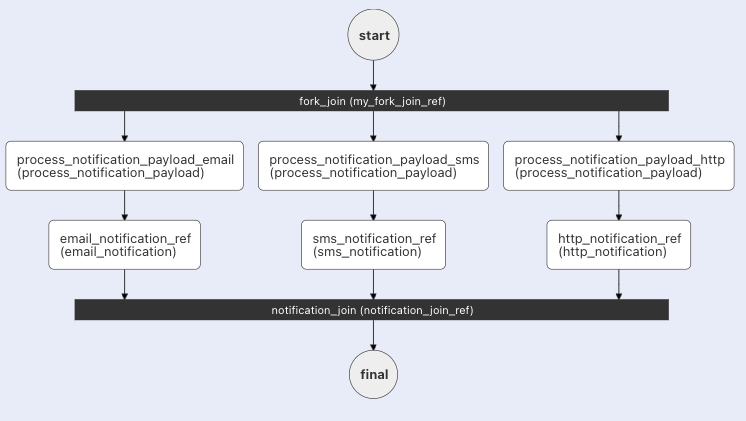

# Fork
```json
"type" : "FORK_JOIN"
```

A `FORK_JOIN` operation lets you run a specified list of tasks or sub workflows in parallel. A `FORK_JOIN` task is
followed by a `JOIN` operation that waits on the forked tasks or sub workflows to finish and collects their outputs.

This is also known as a **Static Fork** to distinguish it from the [DYNAMIC_FORK](dynamic-fork-task.md).

## Use Cases

`FORK_JOIN` tasks are typically used when a list of tasks can be run in parallel. E.g In a notification workflow, there
could be multiple ways of sending notifications, i,e e-mail, SMS, HTTP etc. These notifications are not dependent on
each other, and so they can be run in parallel. In such cases, you can create 3 sub-lists of forked tasks for each of
these operations.

## Configuration

A `FORK_JOIN` task has a `forkTasks` attribute at the top level of the task configuration that is an array of arrays (`[[...], [...]]`);

| Attribute         | Description                                                                                                                                   |
|-------------------|-----------------------------------------------------------------------------------------------------------------------------------------------|
| forkTasks         | A list of lists of tasks. Each of the outer list will be invoked in parallel. The inner list can be a graph of other tasks and sub-workflows |

Each element of `forkTasks` is itself a list of tasks. These sub-lists are invoked in parallel. The tasks defined within each sublist
can be sequential or even more nested forks.

A FORK_JOIN is typically followed by a [JOIN](join-task.md) operation. 

The behavior of a `FORK_JOIN` task is not affected by `inputParameters`.

## Output
`FORK_JOIN` has no output. 

The `FORK_JOIN` task is used in conjunction with the [JOIN](join-task.md) task, which aggregates the output from the parallelized workflows.

## Example

Imagine a workflow that sends 3 notifications: email, SMS and HTTP. Since none of these steps are dependant on the others, they can be run in parallel with a fork.

The diagram will appear as:



Here's the JSON definition for the workflow:

```json
[
  {
    "name": "fork_join",
    "taskReferenceName": "my_fork_join_ref",
    "type": "FORK_JOIN",
    "forkTasks": [
      [
        {
          "name": "process_notification_payload",
          "taskReferenceName": "process_notification_payload_email",
          "type": "SIMPLE"
        },
        {
          "name": "email_notification",
          "taskReferenceName": "email_notification_ref",
          "type": "SIMPLE"
        }
      ],
      [
        {
          "name": "process_notification_payload",
          "taskReferenceName": "process_notification_payload_sms",
          "type": "SIMPLE"
        },
        {
          "name": "sms_notification",
          "taskReferenceName": "sms_notification_ref",
          "type": "SIMPLE"
        }
      ],
      [
        {
          "name": "process_notification_payload",
          "taskReferenceName": "process_notification_payload_http",
          "type": "SIMPLE"
        },
        {
          "name": "http_notification",
          "taskReferenceName": "http_notification_ref",
          "type": "SIMPLE"
        }
      ]
    ]
  },
  {
    "name": "notification_join",
    "taskReferenceName": "notification_join_ref",
    "type": "JOIN",
    "joinOn": [
      "email_notification_ref",
      "sms_notification_ref"
    ]
  }
]
```
!!! note Note
    There are three parallel 'tines' to this fork, but only two of the outputs are required for the JOIN to continue, owing to the definition of `joinOn`. The diagram *does* draw an arrow from ```http_notification_ref``` to the ```notification_join```, but it is not required for the workflow to continue. 

Here is how the output of notification_join will look like. The output is a map, where the keys are the names of task
references that were being `joinOn`. The corresponding values are the outputs of those tasks.

```
{
  "email_notification_ref": {
    "email_sent_at": "2021-11-06T07:37:17+0000",
    "email_sent_to": "test@example.com"
  },
  "sms_notification_ref": {
    "smm_sent_at": "2021-11-06T07:37:17+0129",
    "sms_sen": "+1-425-555-0189"
  }
}
```

See [JOIN](join-task.md) for more details on the JOIN aspect of the FORK.
